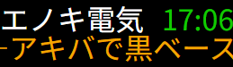

# LEDNEWS

LED電光掲示板を使って最新ニュースを流すためのスクリプト

## 動作環境

- Linux推奨（Windowsでも多分動く）
- apache
- php
- LEDは別のWindows端末を使い、LEDVISIONを使用して表示
- LED制御基板は5A-75Bを使用
- 128x32pxのLEDマトリクスパネル

## 使い方

- ./matrix.html をLEDVISIONで表示させる

## 画像

### スクリーンショット

### 動作画像

